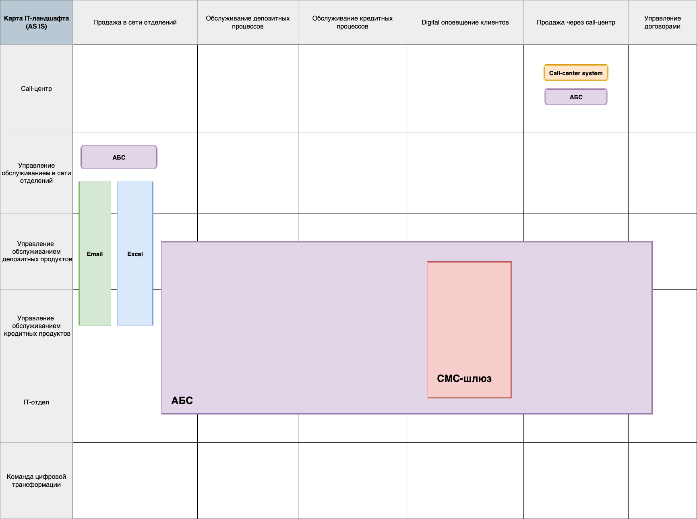

# IT-ландшафт AS-IS

## Карта IT-ландшафта

### 1. Продажа в сети отделений

##### Управление обслуживанием в сети отделений

- взаимодействует с управлениями обслуживанием депозитных/кредитных продуктов посредством отправки Excel-файлов по Email
- создает депозит в АБС

##### Управление обслуживанием депозитных продуктов

- взаимодействует с управлениями обслуживанием кредитных продуктов и с управлением обслуживанием в сети отделений посредством отправки Excel-файлов по Email
- управляет депозитами в АБС

##### Управление обслуживанием кредитных продуктов

- взаимодействует с управлениями обслуживанием депозитных продуктов и с управлением обслуживанием в сети отделений посредством отправки Excel-файлов по Email
- управляет кредитами в АБС

##### IT-отдел

- подержка/разработка AБС

### 2. Обслуживание депозитных процессов

##### Управление обслуживанием депозитных продуктов

- управляет депозитами в АБС

##### Управление обслуживанием кредитных продуктов

- управляет кредитами в АБС

##### IT-отдел

- подержка/разработка AБС

### 3. Обслуживание кредитных процессов

##### Управление обслуживанием депозитных продуктов

- управляет депозитами в АБС

##### Управление обслуживанием кредитных продуктов

- управляет кредитами в АБС

##### IT-отдел

- подержка/разработка AБС

### 4. Digital оповещение клиентов

##### Управление обслуживанием депозитных продуктов

- инициирует SMS-уведомления клиентам через СМС-шлюз
- использует АБС как источник данных для уведомлений

##### Управление обслуживанием кредитных продуктов

- инициирует SMS-уведомления клиентам через СМС-шлюз
- использует АБС как источник данных для уведомлений

##### IT-отдел

- подержка/разработка AБС и СМС-шлюза

### 5. Продажа через call-центр

##### Call-центр

- проводит продажи через Call-center system
- создает и обновляет данные в АБС

##### IT-отдел

- подержка/разработка AБС

### 6. Управление договорами

##### Управление обслуживанием депозитных продуктов

- ведет депозитные договоры в АБС

##### Управление обслуживанием кредитных продуктов

- ведет кредитные договоры в АБС

##### IT-отдел

- подержка/разработка AБС
