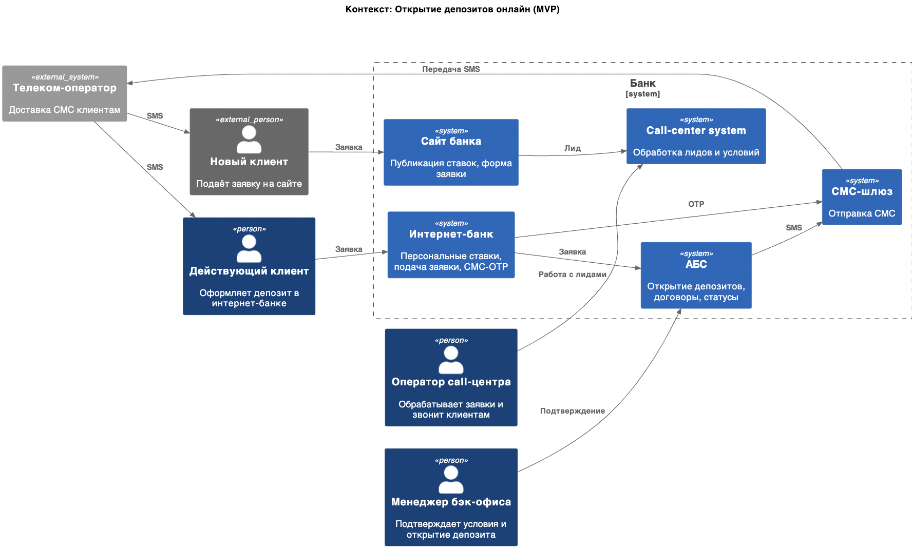
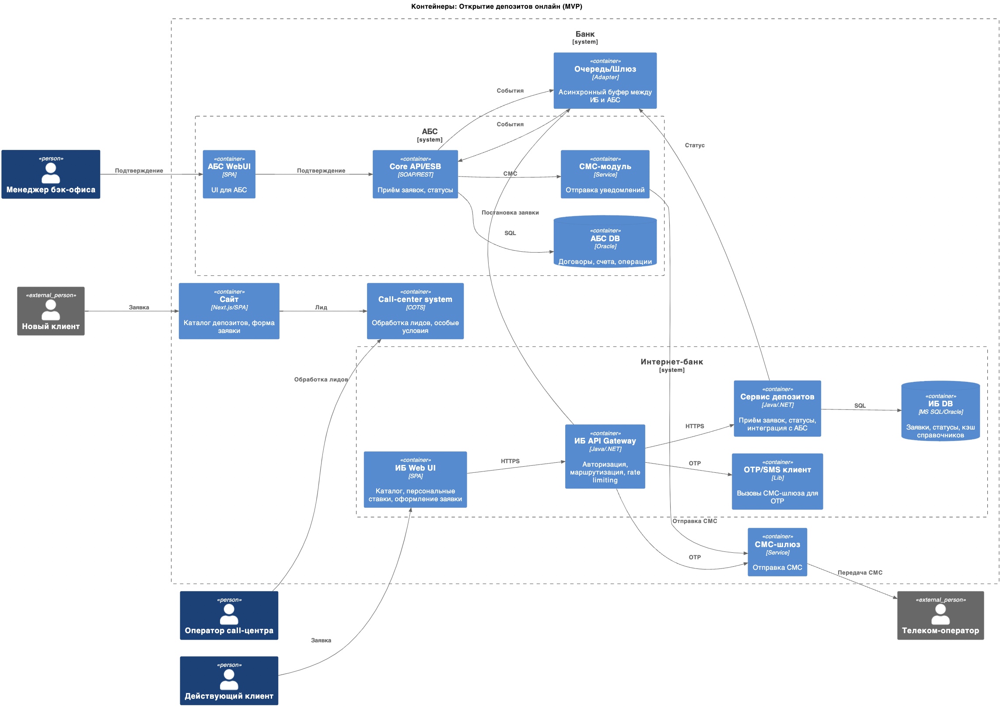

### **Название задачи:** Открытие депозитов онлайн (MVP)

### **Автор:** Созоев Нурбек

### **Дата:** 03.09.2025

### **Функциональные требования**

| **№** | **Действующие лица или системы** | **Use Case**                                                            | **Описание**                                                                                                                                                                                   |
| :---: | :------------------------------- | :---------------------------------------------------------------------- | :--------------------------------------------------------------------------------------------------------------------------------------------------------------------------------------------- |
|   1   | Новый клиент                     | Подача заявки на открытие депозита на сайте банка                       | Клиент заходит на сайт банка, заполняет и отправляет форму (ФИО, номер телефона). Получает смс с кодом подтверждения. Подтверждает. Ожидает звонка.                                            |
|   2   | Call-центр                       | Обработка заявок сделанных на сайте                                     | Сотрудник call-центра видит заявку в своей системе. Звонит клиенту по указанному номеру и уточняет/объясняет условия.                                                                          |
|   3   | Действующий клиент               | Подача заявки на открытие депозита через систему интернет-банкинга      | Клиент заходит в систему интернет-банкинга, выбирает нужный депозит с необходимыми условиями. Получает смс с кодом подтверждения. Подтверждает смс. Видит, что депозит в расмотрении. Ожидает. |
|   4   | Менеджеры бэк-офиса              | Потверждение заявки на открытие депозиты созданного в интернет банкинге | Менеджер бэк-офиса видит заявку на открытие депозита в АБС. Подтверждает заявку.                                                                                                               |
|   5   | АБС                              | Уведомление действующего клиента об изменении статуса заявки            | Отправляет смс уведомление клиенту об изменении статуса заявки                                                                                                                                 |

### **Нефункциональные требования**

| **№** | **Требование**                                   | **Описание**                                                                                                                       |
| :---: | :----------------------------------------------- | :--------------------------------------------------------------------------------------------------------------------------------- |
|  T1   | Доступность 24/7, SLA 99,9% для сервисов         | Процессы ИБ - отказоустойчивы                                                                                                      |
|  T2   | Консистентность данных                           | Eventual consistency между ИБ и АБС; идемпотентные операции; дедупликация                                                          |
|  T3   | Безопасность трафика                             | TLS 1.2+/1.3 для сайта и ИБ; secure headers                                                                                        |
|  T4   | Резервное копирование и восстановление           | Для ИБ: RPO <=15 мин, RTO <=30 мин; тест восстановления                                                                            |
|  T5   | Горизонтальное масштабирование интернет-банкинга | Балансировка по серверам/ЦОД; исключить sticky-сессии                                                                              |
|  T6   | Мониторинг производительности                    | p95/p99 latency, throughput, ошибки; алерты                                                                                        |
|  T7   | Документация                                     | Архитектурные решения, API, события, схемы данных, сценарии отказов                                                                |
|  T8   | Disaster Recovery (восстановление после сбоя)    | Основной и резервный ЦОД; распределение нагрузки                                                                                   |
|  T9   | Защита персональных данных                       | Шифрование «на диске» для чувствительных полей, маскирование логов, средства криптографической защиты информации при необходимости |

### **Решение**

Диаграммы C4 приведены в формате PlantUML:

- [диаграмма контекста](contextDiagram.puml)
  

- [диаграмма контейнеров](containerDiagram.puml)
  

### **Альтернативы**

- **Прямая синхронная интеграция ИБ -> АБС**: вызовы API АБС без очереди.
  - Плюсы: проще реализация, моментальная обратная связь.
  - Минусы: риск перегрузки АБС, повышенная связность, ниже отказоустойчивость.
- **ESB/шина как оркестратор вместо адаптера/очереди**: маршрутизация и трансформация через существующий Core API/ESB.
  - Плюсы: централизованное управление интеграциями, аудит на шине.
  - Минусы: потенциальная точка узкого места, зависимость от команды шины.
- **Микросервисная архитектура интернет-банка**:
  - Плюсы: микросервисы локализует изменения и риски, облегчает масштабирование домена.
  - Минусы: рост операционной сложности (CI/CD, наблюдаемость), межсервисные коммуникации и консистентность, повышенные затраты на поддержку, потребность в экспертизе.
- **OTP/уведомления**: использовать внешний CPaaS/провайдера OTP
  - Плюсы: SLA и аналитика
  - Минусы: внешняя зависимость и стоимость сообщений, требования закона о персональных данных и договорные ограничения, риски вендор‑лока, интеграционные сбои.
- **Удалённая идентификация**
  - Плюсы: рост конверсии, меньше визитов в отделения.
  - Минусы: регуляторные ограничения и необходимость сертификаций, высокая стоимость внедрения eKYC/биометрии

**Недостатки, ограничения, риски**

- **Вертикальная масштабируемость АБС**: даже с асинхронной интеграцией возможны пики нагрузки; ограничение на горизонтальное масштабирование базы АБС.
- **Eventual consistency**: задержка подтверждения статусов заявок; требуется идемпотентность, дедупликация, повторная доставка.
- **Надёжность очереди/адаптера**: риск потери/дублирования сообщений, необходимость мониторинга, алертов и ручных процедур реобработки.
- **Зависимость от СМС‑канала**: задержки доставки OTP, блокировки операторов.
- **Доступность**: целевое 99,9% для ИБ требует избыточности по ЦОД, отказоустойчивого хранения.
- **Зависимость от кол‑центра**: доступность системы кол‑центра влияет на конверсию.
- **Сложность мониторинга**: требуется сквозная корреляция по id заявки, распределённые трассировки.
- **Ограничения KYC**: необходимость визита в отделение может снижать конверсию.
