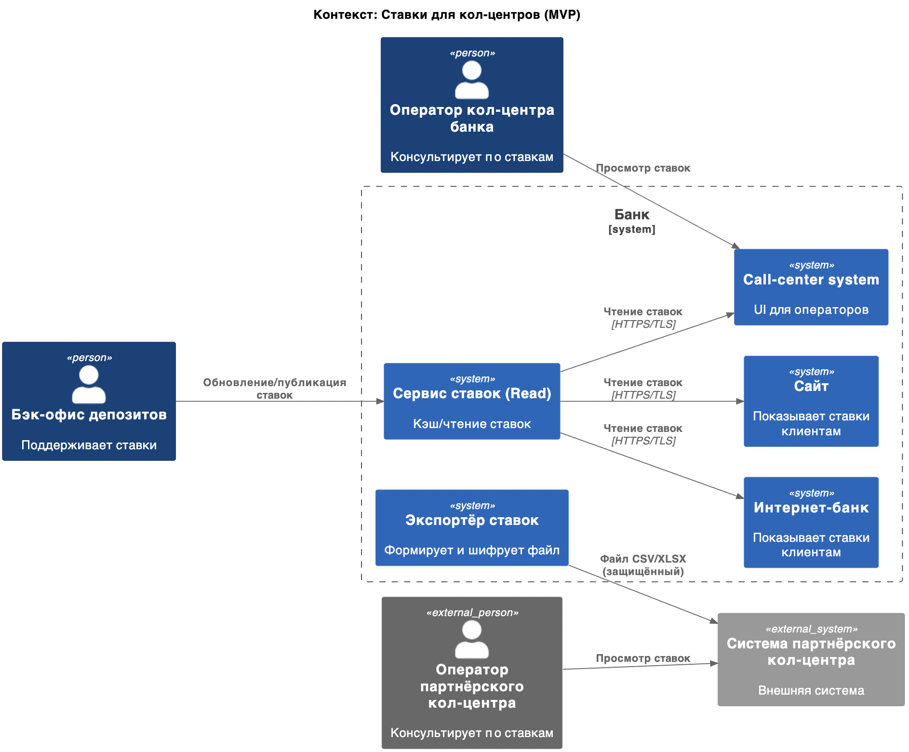
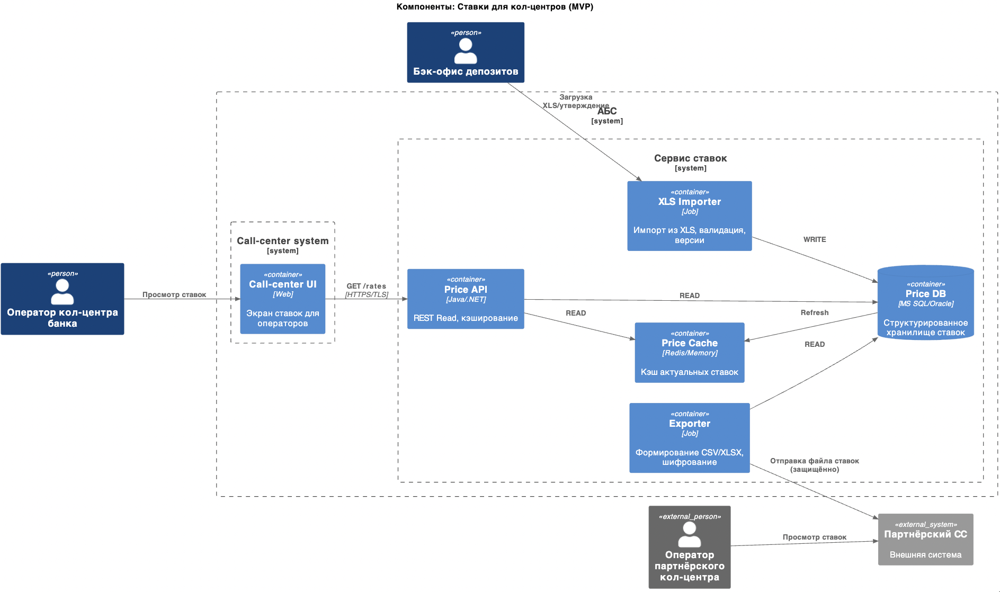
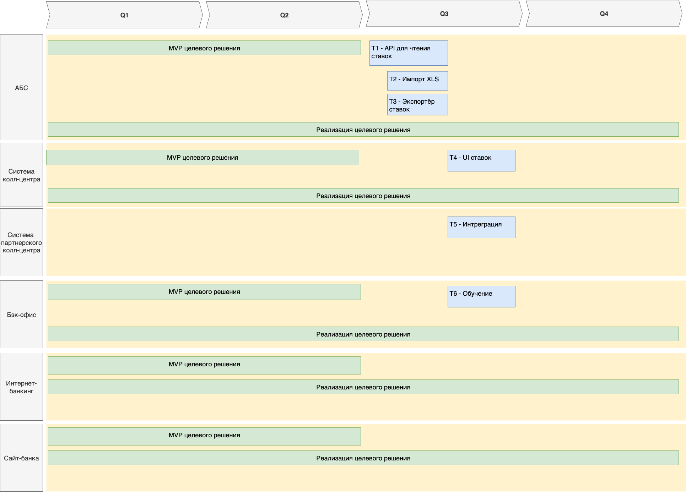

### ADR: Поддержка консультаций по ставкам для кол-центров (MVP)

### Use Cases

|  №  | Действующие лица/системы  | Use Case                    | Описание                                                                                 |
| :-: | ------------------------- | --------------------------- | ---------------------------------------------------------------------------------------- |
|  1  | Оператор кол-центра банка | Просмотр текущих ставок     | В интерфейсе call-center видеть актуальные депозитные ставки для консультаций            |
|  2  | Партнерский кол-центр     | Получение файла со ставками | Получает файл со ставками от банка для загрузки в свою внешнюю систему                   |
|  3  | Бэк-офис депозитов        | Поддержка ставок            | Поддерживает ставки в текущем процессе (XLS -> утверждение) без смены инструмента на MVP |
|  4  | Сайт/ИБ                   | Отображение ставок          | Продолжает показывать актуальные ставки клиентам                                         |

### Функциональные требования

- Единый источник "актуальных ставок" в банке с возможностью экспорта в файл (CSV/XLSX)
- Публикация ставок для call-center system банка через кэшируемое API
- Генерация и безопасная передача файла ставок партнеру (по расписанию и по событию)
- Аудит экспорта/передач файлов, версионирование выгрузок

### Нефункциональные требования

- Защита данных при передаче (TLS для API, шифрование архива файла, пароль раздельным каналом)
- SLA на публикацию ставок: <= 1 мин от изменения до доступности в API; файл партнеру - в течение <= 5 мин
- Наблюдаемость: логи, метрики, трассировки экспорта и выдачи API
- Совместимость с текущим стеком (MS SQL/Oracle; без новых тяжелых платформ)

### Диаграммы C4

- [диаграмма контекста](context.puml)
  

- [диаграмма компонентов](components.puml)
  

### Недостатки и риски

- Остается XLS как первичный артефакт - риск человеческих ошибок
- Задержки в доставке файла партнеру, нужно подтверждение приема

### Задачи

|  №  | Название                             | Описание                                                                                                                        |
| :-: | ------------------------------------ | ------------------------------------------------------------------------------------------------------------------------------- |
| T1  | [АБС] API для чтения ставок          | Read‑API поверх БД ставок, кэш (in‑memory/Redis), пагинация/фильтры, RBAC, аудит вызовов, rate limiting.                        |
| T2  | [АБС] Импорт XLS                     | Полуавтоматическая загрузка XLS/XLSX, валидация шаблона, версионирование, журнал изменений, ручное утверждение.                 |
| T3  | [АБС] Экспортер ставок               | Формирование CSV/XLSX по формату партнера, шифрование архива, доставка по согласованному каналу, подтверждение приема и ретраи. |
| T4  | [Call-center system банка] UI ставок | Экран "Ставки": поиск/фильтры, единицы измерения, локальный кэш; интеграция с T1; права доступа и аудит.                        |
| T5  | [Партнерский кол-центр] Интеграция   | Спецификация формата, расписание выгрузок, тестовый контур, подпись/шифрование, процесс приема и загрузки на стороне партнера.  |
| T6  | [Бэк-офис депозитов] Обучение        | Регламент обновления ставок, роли согласующих, SLA публикации, операционные инструкции по импорту/экспорту.                     |

### Роадмап

[Исходники](roadmap.drawio)

